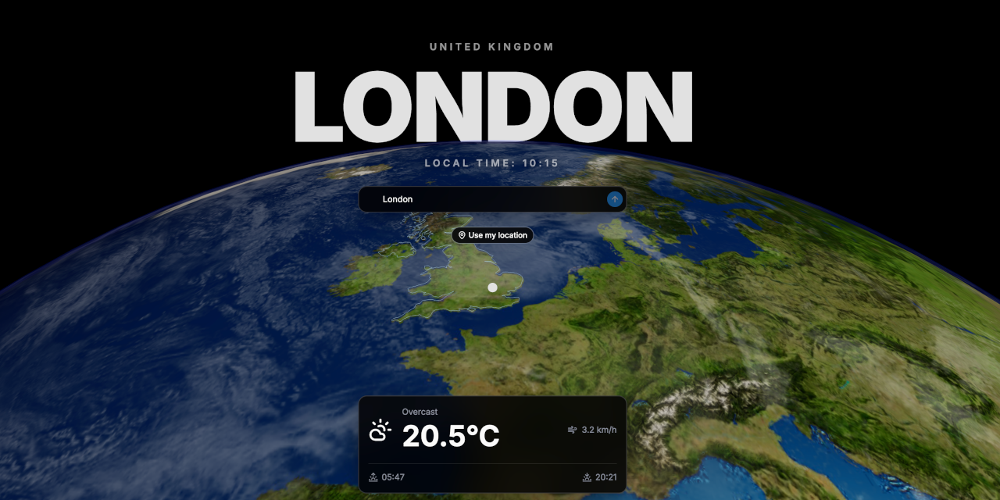

# K-Weather

A 3D weather globe — view Earth from orbit.

## What is it?

K-Weather is a weather app built around an interactive 3D globe. Rather than a static list of conditions, you get to see Earth from space, rotate to the place you care about, and watch the sun and day/night lighting follow the real world.

Pick any city in the world — or just hit **Use my location** — and the globe will spin to focus on that spot.

## How it works

1. **Pick a location.** Start typing a city name and results appear as you type, or use your current location with a single tap.
2. **Watch the globe react.** The globe rotates to center on the selected place and the country outline is drawn live.
3. **Get the forecast.** A current weather card and the next 12 hours appear, pulled straight from the selected coordinates.
4. **Make it yours.** Click a temperature to toggle °C/°F, or the wind speed to toggle km/h/mph — your preference is remembered between visits. The selected location is kept in the URL, so you can bookmark or share it.

Everything runs in the browser, no API keys or accounts required.

## APIs used

| Purpose | API |
|---|---|
| Current weather + hourly forecast | [Open-Meteo](https://open-meteo.com/) `v1/forecast` |
| Place search (geocoding) | [Open-Meteo](https://open-meteo.com/) Geocoding `v1/search` |
| Reverse geocode ("Use my location") | [BigDataCloud](https://www.bigdatacloud.com/) reverse-geocode |
| Country outlines for the globe | Local GeoJSON (`public/data/countries.geojson`) |
| On-demand geolocation | Browser Geolocation API (consent-only) |

## Tech stack

- **Next.js 16** + **React 19**
- **Three.js** / **React Three Fiber** — 3D globe
- **Tailwind CSS 4** + **shadcn/ui** — UI
- **Vitest** + **Testing Library** — tests

## Development

```bash
npm run dev        # start the dev server
npm run test:run   # run the test suite once
npm run lint       # eslint
npm run build      # production build (static export)
```

## Additional Docs

- [Deployment](docs/deployment.md) — how AWS Amplify hosts and deploys K-Weather